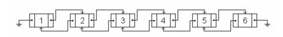
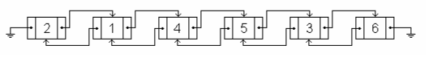

### LISTA

Mirko received a birthday present from his aunt in the US – a brand-new doubly-linked list (an example 
of which is shown in the figure below). The list contains N nodes numbered 1 through N. Two types 
of moves can be done on the list: A)  Move node X in front of node Y. B)  Move node X after node Y.  



An example of a list with 6 nodes. 
 


The list after the move "A 1 4". 



The list after another move, "B 3 5". 
 
Mirko played with his new toy for hours, writing down each move on a piece of paper so that he can 
reconstruct the list's initial state (nodes 1 through N in order from left to right). When  he  decided  to  reconstruct  the  list,  Mirko  was  astonished  to  find  that  there  is  no  easy  way  to  
invert the moves and restore the list's initial state. Mirko cannot know where node X was prior to each 
move, only where it ended up. Seeing how Mirko is still recovering from the shock, write a program that finds a minimal sequence of 
moves that restored the list's initial state from Mirko's logs.


#### Input 
The first line of input contains two integers N and K (2 ≤ N ≤ 500 000, 0 ≤ M ≤ 100 000), the number 
of nodes and the number of moves made by Mirko. Each of the next M rows contains a description of a single move made by Mirko – the type of move 
('A' or 'B') and two integers X and Y. 


#### Output 
Output the minimum number of moves (call this number K) on the first line. Each  of  the  next  K  lines  should  contain  a  descriptio n   o f   a   s i n g l e   m o v e   i n   t h e   s a m e   f o r m a t   a s   i n   t h e   
input. 
**Note:** The sequence need not be unique.


#### Scoring 
If  both  the  number  K  and  the  sequence  of  moves  are  correct,  your  program  will  score  full  points  on  
the test case. If  your  program  outputs  the  correct  number  K  and  does  not  output  the  sequence  of  moves,  or  the  
sequence of moves is incorrect, you will get 60% of the points for that test case.


!!! question "Test 1"
    ???+ "Input"
        ```
        abc
        ```
    ???+ "Output"
        ```
        abc
        ```
    ??? warning "Note"
        abc

!!! question "Test 1"
    ???+ "Input"
        ```
        abc
        ```
    ???+ "Output"
        ```
        abc
        ```
    ??? warning "Note"
        abc

!!! question "Test 1"
    ???+ "Input"
        ```
        abc
        ```
    ???+ "Output"
        ```
        abc
        ```
    ??? warning "Note"
        abc